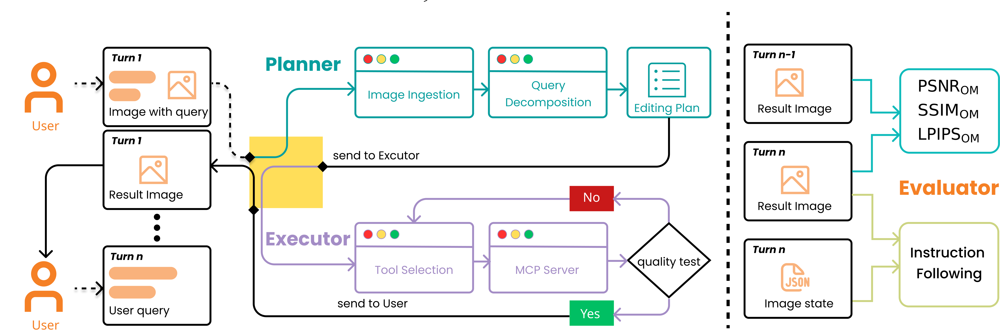
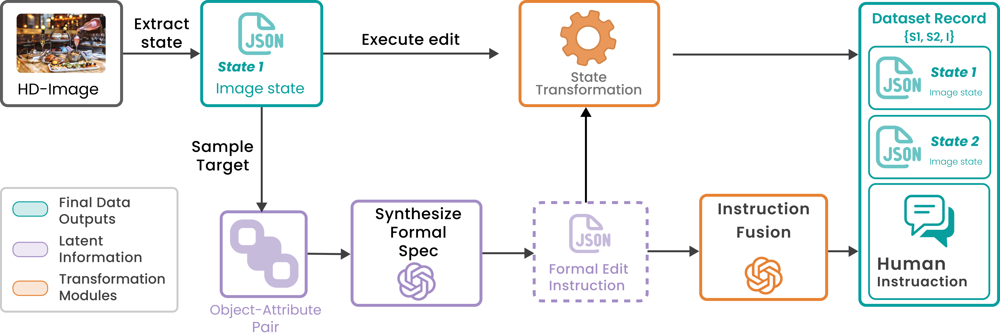

# 4KAgent: Agentic Any Image to 4K Super-Resolution

<div align="center">

[](https://agent-banana.github.io)&nbsp;
[](https://arxiv.org/abs/2507.07105)&nbsp;
<!-- []() -->


</div>


<p align="center">
  <a href="https://arxiv.org/abs/2507.07105">
    <strong><em>Agent banana: High-Fidelity Image Editing with Agentic Thinking and Tooling</em></strong>
  </a>
</p>
<p align="center">
  <strong><em>🚧 Code coming soon. Stay tuned!</em></strong>
</p>


<p align="center">
    
<p>


## Introduction

We present **Agent Banana**, a agentic planner–executor framework designed for high-fidelity, object-aware, thinking with editing. **Agent Banana** offers these key features:

- 🔥 **Framework**: **Agent Banana** couples high-level reasoning with tool-use capabilities to decompose complex requests into atomic sub-edits. It employs "Photoshop-style" layer isolation and masking to ensure precise modifications while preserving non-target content.

- 🔥 **Context Folding**: To enable stable long-horizon control, we introduce **Context Folding**, which compresses long interaction histories into structured memory. This allows the system to track state changes effectively and support rollback/replanning across multi-turn interactions.

- 🔥 **Image Layer Decomposition**: We propose **Image Layer Decomposition** to perform edits on isolated high-resolution layers. This approach prevents drift across iterations and ensures that edits are applied at native resolution without downsampling artifacts.

- 🔥 **HDD-Bench**: We release **HDD-Bench**, a high-definition, dialogue-based benchmark featuring verifiable stepwise targets and native 4K images. Unlike prior single-turn benchmarks, it supports rigorous diagnosis of long-horizon failures and professional workflow simulation.

- 🔥 **Performance**: On HDD-Bench, **Agent Banana** achieves state-of-the-art results in multi-turn consistency and background fidelity (e.g., IC 0.871, SSIM 0.84) while remaining competitive on instruction following.


## Pipeline

<p align="center">
    
<p>

<p align="center">
    
<p>


## Citation
```
@article{zuo20254kagent,
      title={4KAgent: Agentic Any Image to 4K Super-Resolution}, 
      author={Yushen Zuo and Qi Zheng and Mingyang Wu and Xinrui Jiang and Renjie Li and Jian Wang and Yide Zhang and Gengchen Mai and Lihong V. Wang and James Zou and Xiaoyu Wang and Ming-Hsuan Yang and Zhengzhong Tu},
      year={2025},
      eprint={2507.07105},
      archivePrefix={arXiv},
      primaryClass={cs.CV},
      url={https://arxiv.org/abs/2507.07105}, 
}
```